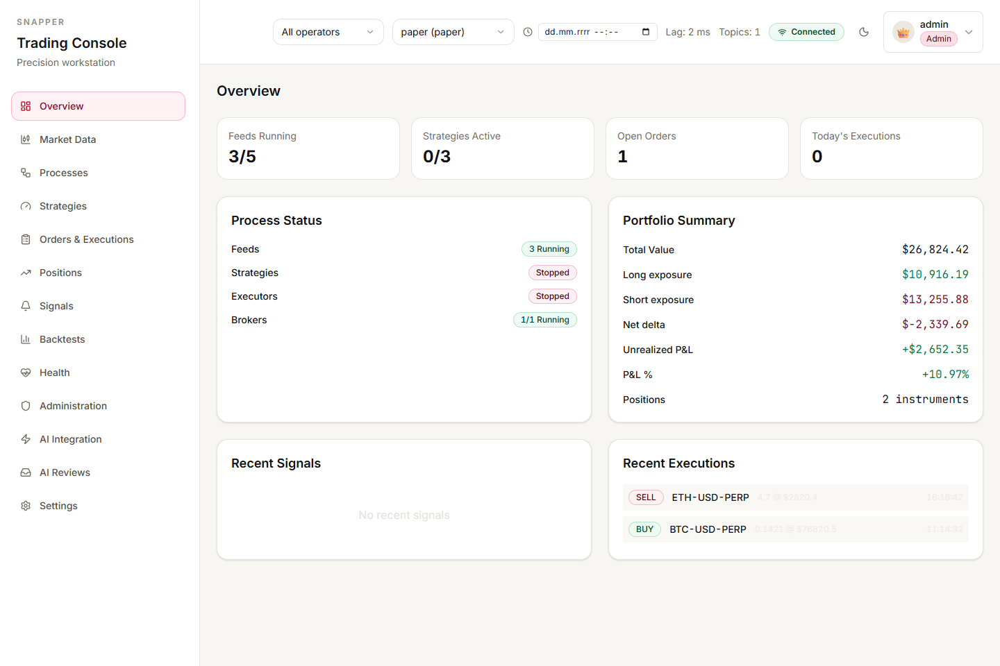
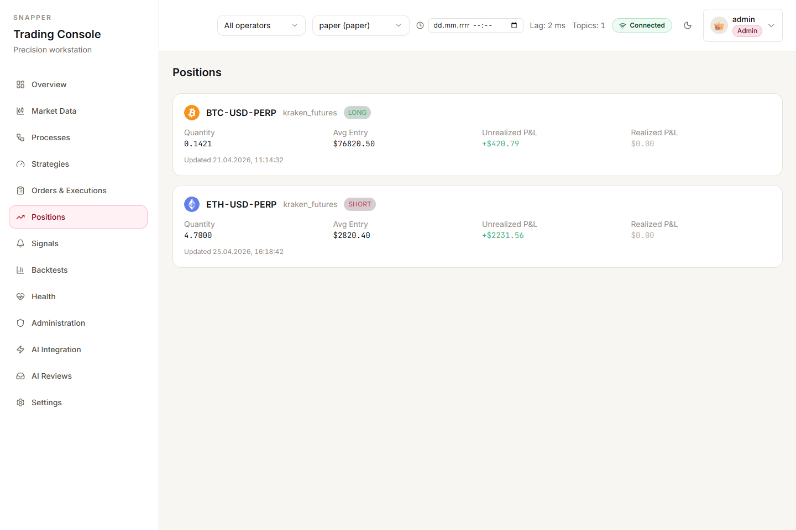
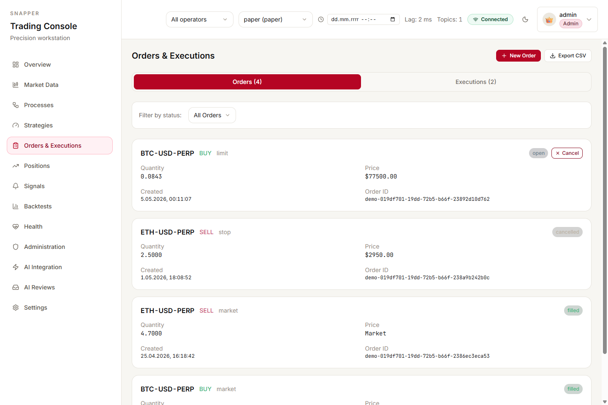
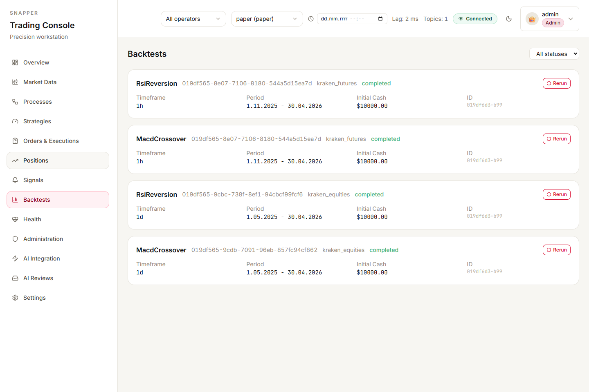
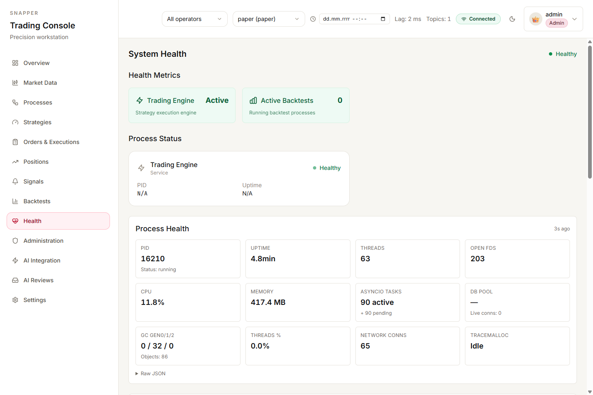
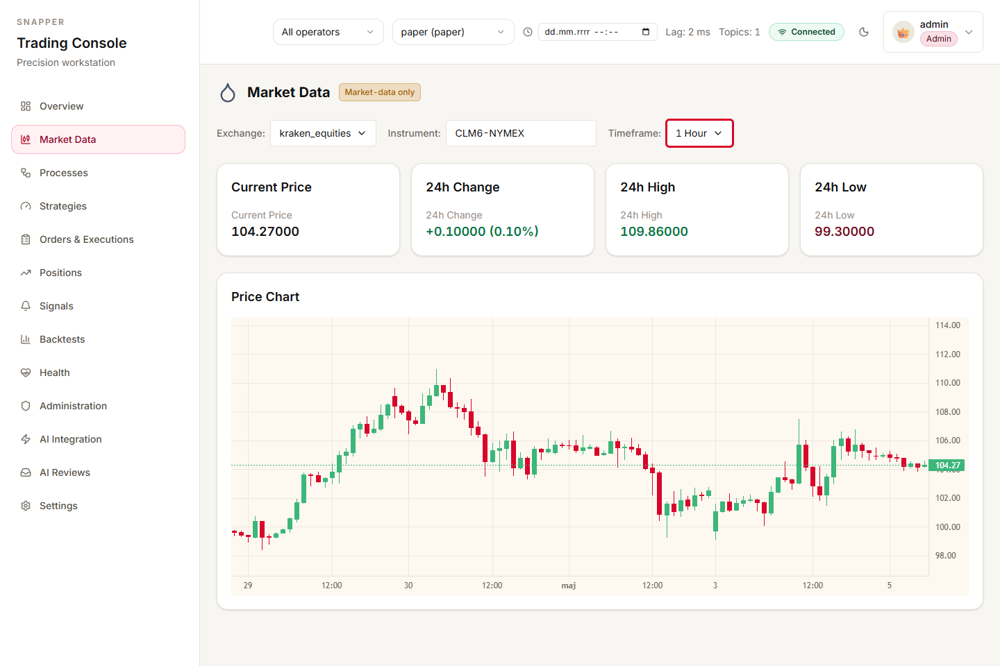
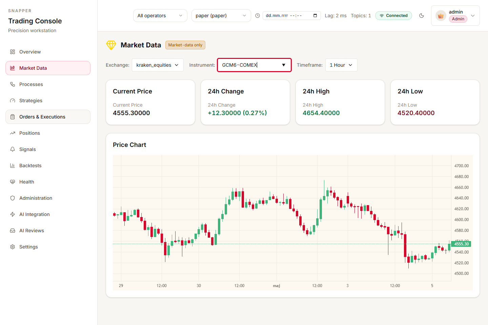
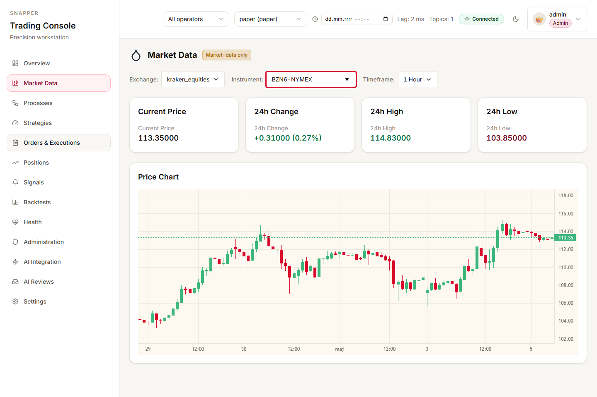
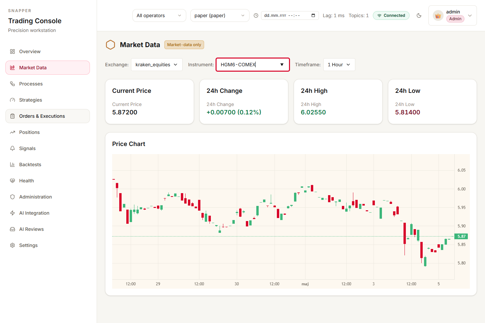
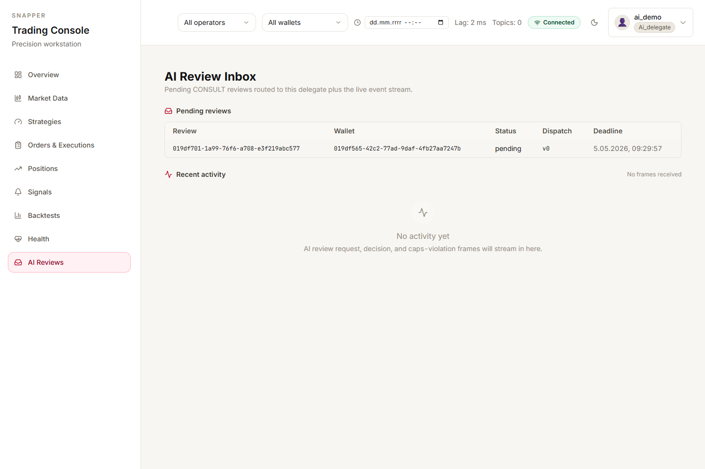

# Snapper Frontend

[](https://github.com/mateusz-klatt/snapper-frontend/actions/workflows/ci.yml)
[](https://github.com/mateusz-klatt/snapper-frontend/actions/workflows/gitleaks.yml)
[](https://opensource.org/licenses/MIT)

Vite + React + TypeScript trading UI for the [Snapper](https://github.com/mateusz-klatt/snapper) platform.

## What it is

The browser-side dashboard for Snapper — a single-operator portfolio + execution platform that talks to crypto and forex venues over WebSocket and REST. This repo contains only the UI; the backend (FastAPI + SQLAlchemy + ZMQ) lives in the parent repo.

Highlights:

- **Smart-hybrid InstrumentIcon dispatcher** — text fallback first, vendored SVG when available, mixed-mode pair icons (e.g. SHIB-EUR shows text + EU flag).
- **Vendored crypto + flag icons** — 27 crypto + 24 flag SVGs in `public/icons/`. Zero CDN dependency, air-gap ready.
- **WalletPicker with HYBRID scope persistence** — URL params override localStorage override auto-pick first wallet. Reload survives.
- **Hash-based subroute routing** — `useHashSubpath` handles deep routes like `#backtests/<uuid>?wallet=X` without query-collision bugs.
- **WebSocket envelope minter** — per-app session ID, separate control / telemetry counters, ms-precision ISO-8601 provenance stamping.
- **Order entry** — bracket and trailing-stop dialogs with capability-guard error mapping.

## Screenshots

Snapshots from a local instance running against the [snapper](https://github.com/mateusz-klatt/snapper) backend with a seeded paper-mode portfolio: long BTC-USD-PERP + short ETH-USD-PERP on Kraken Futures, four completed backtests spanning crypto and CME / NYMEX commodity futures, a multi-commodity 1h research panel (June WTI crude, June Gold, June Brent, June Copper), a Hormuz-driven AI review pending in the delegate inbox.





















## Getting started

Prerequisites: **Node 22+**, **pnpm 10** (auto-installed via Corepack from `packageManager` in `package.json` — run `corepack enable` once), a running Snapper backend at `http://localhost:8000`.

```bash
corepack enable        # one-time, enables packageManager pnpm pin
pnpm install
pnpm dev               # vite dev server on http://localhost:3000
```

The dev server proxies `/api`, `/api/ws`, `/docs`, `/redoc`, and `/openapi.json` to the backend at `http://localhost:8000` — same-origin, no env-var configuration required. Bind to LAN with `make dev-lan` (binds `0.0.0.0:3000`) when you need to access the dev server from another device.

Other useful targets:

```bash
make typecheck    # tsc --noEmit
make lint         # eslint, fails on any warning
make test         # vitest run
make cov          # vitest with coverage (100% threshold)
make check-all    # lint + format + typecheck + test + dead-code + cov + build
```

## Generated types

The following files are generated from the Snapper backend's OpenAPI / WebSocket / Pydantic / RBAC schemas and committed so the repo builds out of the box:

- `src/types/api.generated.ts` — OpenAPI → TypeScript (regenerable here via `make gen`)
- `src/types/ws.generated.ts` — WebSocket JSON Schema → TypeScript (regenerable here via `make gen`)
- `src/types/entities.generated.ts` — backend Pydantic entity models (regenerated upstream by the backend; ship as committed contract)
- `src/types/permissions.generated.ts` — backend RBAC permission catalog (regenerated upstream by the backend)
- `src/lib/schemas/api.generated.zod.ts`, `ws.generated.zod.ts` — runtime Zod validators derived from the same schemas (regenerated upstream)

To refresh the OpenAPI/WS subset against a running backend at `http://localhost:8000`:

```bash
make gen
```

The full set is regenerated by the backend (it owns the `Pydantic` and RBAC sources); pull the regenerated files into a PR when you bump the submodule pointer in the parent monorepo. See `scripts/gen-from-backend.sh` for the public-side flow.

## Vendored icons

`public/icons/crypto/` and `public/icons/flags/` are vendored SVGs (no runtime CDN). To re-vendor or add new icons:

```bash
pnpm icons:vendor
```

Sources are tracked in `scripts/vendor-icons.sh` and the manifest is regenerated at `src/components/InstrumentIcon/iconManifest.generated.ts`.

## Architecture notes

- **Smart-hybrid dispatch tiers** — Tier 1 vendored single-asset SVG, Tier 2 mixed pair (text base + vendored quote flag, or vice versa), Tier 3 text fallback. Rules spelled out inline in `src/components/InstrumentIcon/types.ts`.
- **`taxRules.ts`** — Polish PIT / DE / FR cost-basis rules cite their source statutes (Ustawa o PIT art. 17 ust. 1f pkt 11, KIS interpretation lineage, EU equivalents). Update with caution; tax-treatment changes need legal review.
- **`useHashSubpath`** — strips `?query` before splitting on `/`, fixing the deep-route + scope-query collision (e.g. `#backtests/<uuid>?wallet=X` correctly returns `["<uuid>"]` not `["<uuid>?wallet=X"]`).

## Release contract (1.0+)

Stable from `1.0.0` onward; subsequent releases follow Semantic Versioning:

- **`MAJOR` (`2.0.0`, `3.0.0`, …)** — breaking changes to user-facing UI flows or to the assumed backend API/WebSocket contract. Breaking changes are announced in `CHANGELOG.md` and accompanied by an `UPGRADING-N.md` note.
- **`MINOR` (`1.1.0`, `1.2.0`, …)** — new screens, new feature surfaces, new accepted backend frames. Backwards-compatible by default.
- **`PATCH` (`1.0.1`, …)** — bug fixes, accessibility tightening, security patches. No behaviour changes for existing flows.

### Supported runtime

- **Browsers** — current and previous major release of Chrome, Edge, Firefox, Safari (so 2 versions back from "latest"). Other browsers may work but are not gated by CI. Open an issue if you hit a regression in scope.
- **Node + pnpm (for contributors)** — Node `>=22`, pnpm `>=10`, enforced via `engines` + `engine-strict`.
- **Backend pairing** — this frontend release pairs with the `mateusz-klatt/snapper` backend at the submodule pointer recorded against the matching frontend tag. Generated types (`src/types/*.generated.ts`, `src/lib/schemas/*.generated.zod.ts`) are committed; regenerate with `make gen` against a local backend if you point at a different commit.

### Accessibility target

Targets **WCAG 2.1 AA** for the shipped UI flows (login, navigation, market data, orders, backtests, modals). The picker controls follow the W3C ARIA APG combobox/listbox pattern. Found a regression? File an issue with reproduction + screen reader/version.

### Internationalisation

**English only** for `1.0.x`. UI strings are not externalised. Locale-aware number/date rendering uses `Intl.NumberFormat`/`Intl.DateTimeFormat` with the browser locale, and a few user-facing strings are localised inside specific datepickers (PL labels). A future minor version may add a translation layer; this is not on the `1.0.x` roadmap.

### Privacy + storage

The frontend does not load third-party trackers, analytics, or fonts. Local browser storage is limited to:

- `sessionStorage`: `snapper_sequence_tracker` (per-session UUIDv7 + per-table sequence counter, used for control-frame provenance). Cleared when the tab closes.
- `localStorage`: scope-persistence (last selected wallet/operator) — UUID strings only.
- `cookies`: backend-issued auth + CSRF cookies. Lifecycle is owned by the backend.

No telemetry is sent from the browser. All network traffic goes to the same origin (`/api/*`, `/api/ws`).

### Self-hosting security guidance

When hosting `snapper-frontend` behind a reverse proxy (recommended), set:

- `Strict-Transport-Security: max-age=31536000; includeSubDomains` (HTTPS only)
- `Content-Security-Policy: default-src 'self'; img-src 'self' data:; style-src 'self' 'unsafe-inline'; connect-src 'self' wss:`
- `X-Frame-Options: DENY` (or CSP `frame-ancestors 'none'`)
- `X-Content-Type-Options: nosniff`
- `Referrer-Policy: strict-origin-when-cross-origin`

For HTTPS deployments, mark the backend's auth + CSRF cookies `Secure` + `HttpOnly` (auth) / `SameSite=Lax`.

### Deprecation policy

Public-facing features (UI flows, route paths, hash-subroute schemes, backend frame contracts) marked deprecated in a `MINOR` release will be removed in the **next** `MAJOR` release at the earliest. The `CHANGELOG.md` lists deprecations under a `### Deprecated` heading.

## Contributing

See [CONTRIBUTING.md](CONTRIBUTING.md). Forks welcome; PRs get reviewed against `master`.

## License

[MIT](LICENSE) — Mateusz Klatt, 2026.
